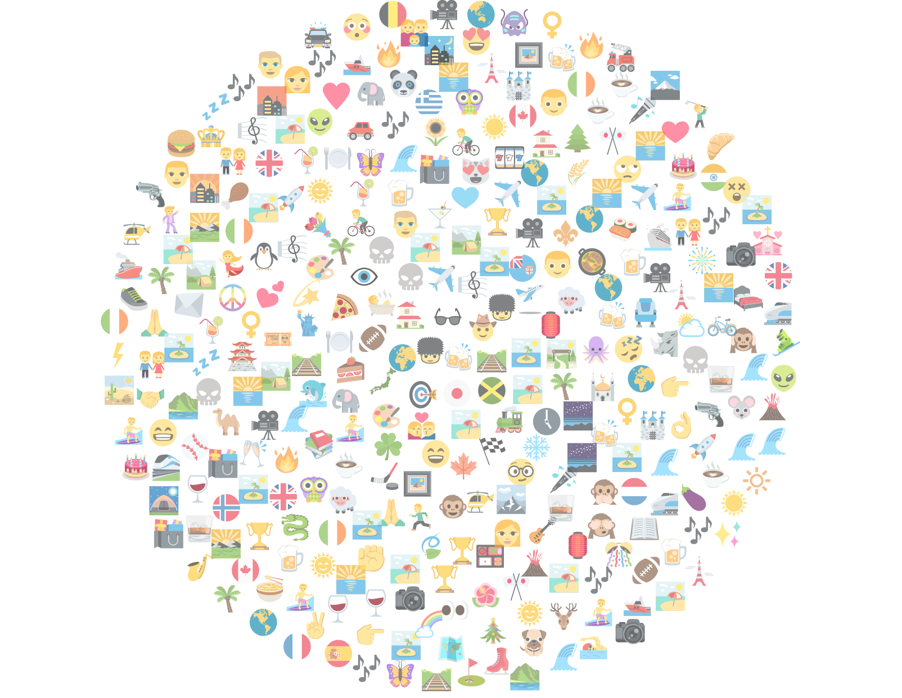
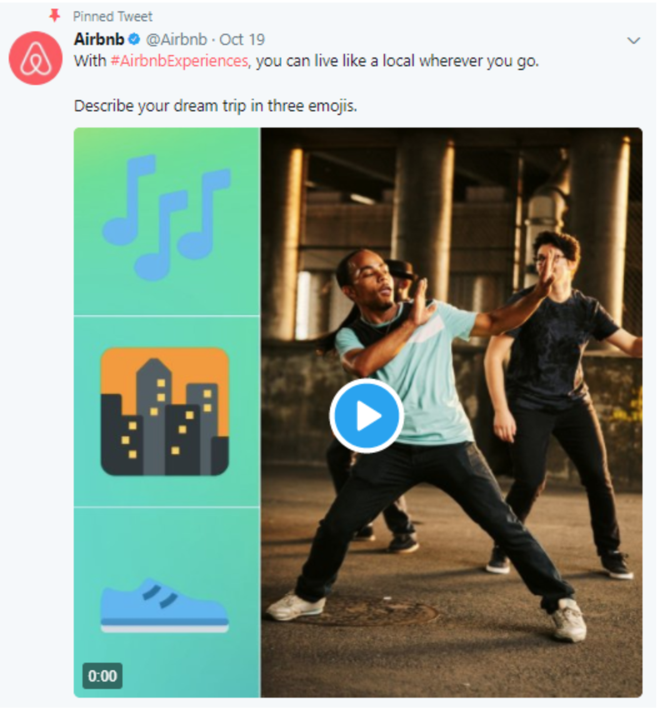

```{r setup, include=FALSE}
knitr::opts_chunk$set(echo = TRUE)
```

# Quantitative Text Analytics

*Content*
- Text analytics and its use in business/business research
- Basics
- Available instruments: R packages and methods
- Pre-processing:
    - Keep or remove decision
    - 
- BoW approaches:
    - Sentiment analysis
    - Topic modeling
    
- SQ: `keras`

- Pre-processing:


### Valence shift


Valence, as used in psychology, especially in discussing emotions, means the intrinsic attractiveness/"good"-ness (positive valence) or averseness/"bad"-ness (negative valence) of an event, object, or situation.[1] The term also characterizes and categorizes specific emotions. For example, emotions popularly referred to as "negative", such as anger and fear, have negative valence. Joy has positive valence. Positively valenced emotions are evoked by positively valenced events, objects, or situations. The term is also used to describe the hedonic tone of feelings, affect, certain behaviors (for example, approach and avoidance), goal attainment or nonattainment, and conformity with or violation of norms. Ambivalence can be viewed as conflict between positive and negative valence-carriers.[citation needed]


`sentimentr`: built on `syuzhet` package, calculate text polarity sentiment at the sentence level and optionally aggregate by rows or grouping variable(s)

Example: https://www.r-bloggers.com/handling-happy-vs-not-happy-better-sentiment-analysis-with-sentimentr-in-r/
IMAGE - 


*Text analytics* refers to applying statistical and machine learning techniques to extract useful insights from text 

The focus of my research is the use of text analytics for social media data. Businesses are excessively pressed for the need to engage with social media and explore its potential for stakeholders engagement, e.g. customers, shareholders. Companies target to monitor the social media space to understand customers' changes preferences, comptetitors offers, market trends, investors' sentiment.


Basics:

*Corpus*: body of text

*Token*: smallest unit of the text, e.g. words within a sentence, sentence within a text.

*Lexicon*: collection of words and their meanings. 

BoW
 dimensions are words, values are their frequences

Corpus: a data set = collection of documents
Lexicon:complete and distinct set of words used to define the corpus

High-dimensional, sparse, and non-negative representation
Dimensions: binary representation: 1 = the presence of a term in a document, 0, otherwise. 
most values of the dimensions are 0s, and only a few dimensions take on positive values

*Which token?*
a sentence, word, n-gram, morpheme, letter

Multidimensionality and sparseness of the data:
- Number of words -> dimensions of data
- Most word frequences are zero

Depends on 
- tasks
- their specification
- heuristics
- preconditions

## Bag-of-words (BoW) vs sequential representation (SR) of text 
Data-centric aspects: 
- length of the text: small for SR, longer for BoW

Application-centric aspects:
- method requires to treat sentences as sentences -> SR
e.g. text summarization, information extraction, opinion mining, and question answering

*BoW* 
- most commonly used representation for text mining
- the ordering of words is lost
- text is converted to a sparse multidimensional representation: the universe of words (or terms) are dimensions (or features) 
- **Application**: classification, topic-modeling, and recommender systems

*SR*
- the ordering is preserved: localized within sentence or paragraph boundaries
- text is a collection of smaller units, e.g. sentences, paragraphs 
- individual sentences are extracted as strings or sequences. 
- **Application**: language modeling, natural language processing

*Language Modeling*:probabilistic models that are able to predict the next word in the sequence given the words that precede it.

Uses: Machine Translation, spell Correction, speech Recognition, summarization, question answering, sentiment analysis etc.

## R Packages

- `tidytext`: (0.2.1 version)[https://cran.r-project.org/package=tidytext] 
    - new plotting functions
    - tokenizer for tweets
    - unnest_token has extra arguments for "tweets": `strip_punct` and `strip_url`.

-  `textdata`: `tidytext` uses it to access (lexicons)[https://github.com/EmilHvitfeldt/textdata]. Bing Liu lexicon (tidytext), AFINN (textdata), NRC lexicon (N/A)

*Changes*: licensing is fixed and the user needs to agree to dataset’s license/terms of use.

- `quanteda`: by Kenneth Benoit et al. for textual data management and analysis

#Basics
*TF = Term Frequency*: 
TF(t) = (Number of times term t appears in a document) / (Total number of terms in the document).

*IDF = Inverse Document Frequency*:
IDF(t) = log(Total number of documents / Number of documents with term t in it)

*Tf-idf* = TF * IDF

## Text Preprocessing 

* Get your data
* Preparation and cleaning
* Segmentation
* Tokenization
* Stop-word numbers and punctuation removal
* Convert to lowercase
* Converting to a "structured" form

    + Option 1 - tf df matrix:
    + Option 2 - tibble
    
*Keep or remove?*
Data mining preceeds text analytics and refers to cleaning and data preparation: transformation of the unstructured text into a structured data, e.g. tf-idf matrix. But.. is it all noise?

- Text extraction and removal of web-specific elements

- stop-word removal: commonly occurring words with little discriminative power

### Textual paralanguage - Great, Umm, *Eyeroll*
Paralanguage (paralinguistics) is a component of meta-communication that may modify meaning, give nuanced meaning, or convey emotion

Textual paralanguage signals informality of the communication and has negative affect on perceptions of brand (company) competence. But when it is used by a brands spokescharacter, there is no negative effects as such communication is already perceived as informal.

#IMAGE - most used # ? !


### Emojis

```{r echo=FALSE, out.width=300}

```

Emojis are ideograms and smileys used in electronic messages and web pages. Twitter now supports 1100+ emoji and develops its own project, (Twemoji)[https://github.com/twitter/twemoji], that supports 3,075 emojis

Traditionally thought of as a ultimate elevator pitch for (business promotion)[https://business.twitter.com/en/blog/5-ways-to-increase-your-tweet-engagements-with-emojis.html].

(AirBnb project)[https://christinequan.github.io/airtweets/] : "Describe your dream trip in 3 emojis"

```{r echo=FALSE, out.width=300}

```

How-to
- extract emojis from tweets, use `stringr` 
- use a dictionary to translate emojis
- (categorise)[https://emojipedia.org/] emojis


tf df matrix approach:

* Stemming / 
* POS tagging
* Create text corpus
* Term-Document matrix


There is a difference when using `tidytext`, `tm` and `quanteda` packages:


However, differences exist between packages as how tf-idf is calculated:

```{r, echo=TRUE, error=FALSE, warning=FALSE, message=FALSE}
library(tm)
library(tidytext) 
library(tidyverse) 
library(quanteda)
df <- as.data.frame(cbind(doc = c("doc1", "doc2"), text = c("the quick brown fox jumps over the lazy dog", "The quick brown foxy ox jumps over the lazy god")), stringsAsFactors = FALSE)

df.count1 <- df %>% unnest_tokens(word, text) %>% 
  count(doc, word) %>% 
  bind_tf_idf(word, doc, n) %>% 
  select(doc, word, tf_idf) %>% 
  spread(word, tf_idf, fill = 0) 

df.count2 <- df %>% unnest_tokens(word, text) %>% 
  count(doc, word) %>% 
  cast_dtm(document = doc,term = word, value = n, weighting = weightTfIdf) %>% 
  as.matrix() %>% as.data.frame()

df.count3 <- df %>% unnest_tokens(word, text) %>% 
  count(doc, word) %>% 
  cast_dfm(document = doc,term = word, value = n) %>% 
  dfm_tfidf() %>% as.data.frame()
```

#BoW approaches
##Sentiment
## text polarity sentiment

***
### Dealing with unstructured data 


***
### Effective workflow for text analytics

Types of input:

knitr::include_graphics("image/SQ_app.jpg")

*Approaches*
* Modeling: inferential models, predictive models or prescriptive models
* Training and evaluation of models
* Application of these Models
* Visualization
* Google Cloud - Natural language API


*Correspondence Analysis*: 
a data science tool for summarizing tables
scaling documents on multiple dimensions


SQ: 
Machine Language Translation

Text summarization: customer complaints, customer feedback, monitoring compliance based call, chat monitoring.

Chatbot 


Examples of text analytics: association analysis:

* visualization
* predictive analytics
* information retrieval
* lexical analysis
* pattern recognition
* tagging/annotation

## Text analytics techniques


Tidytool ecosystem library
how to integrate natural language processing
Sentiment analysis
td-idf
network analysis of words
supervised text models
unsupervised text models


##td-idf
*term frequency–inverse document frequency*

* statistical measure 

* shows importance of a word is in  a document in a collection of documents (corpus)

* the more times a word is used in a document, the higher the importance, but also how often a word appears in the corpus.

#Text generation

`keras` package allows to use (Keras)[https://keras.io] and TensorFlow in R.

Tutorials are available (here)[https://keras.rstudio.com/articles/getting_started.html#tutorials], including this (one)[https://keras.rstudio.com/articles/tutorial_basic_text_classification.html] on text classification.

library(keras)
library(tidyverse)
library(janeaustenr)
library(tokenizers)