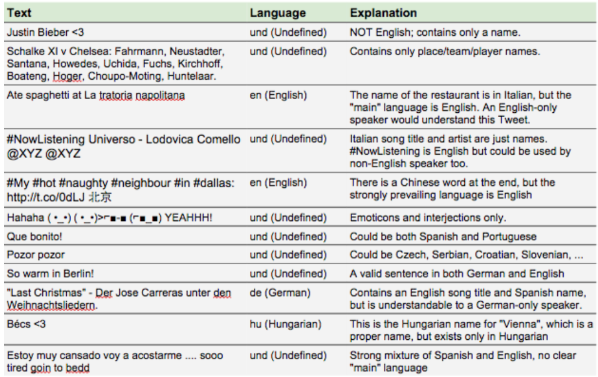
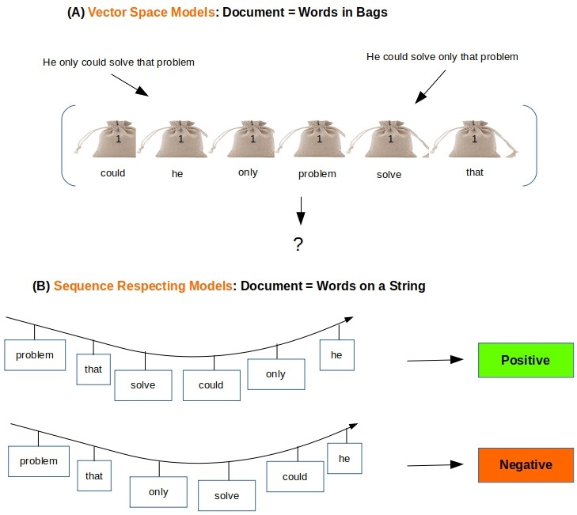
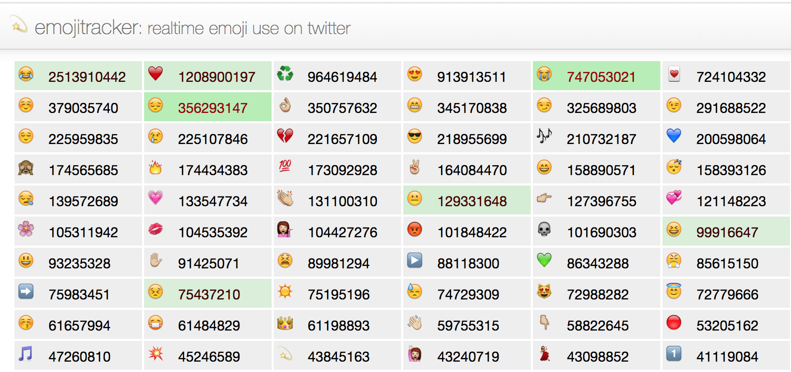
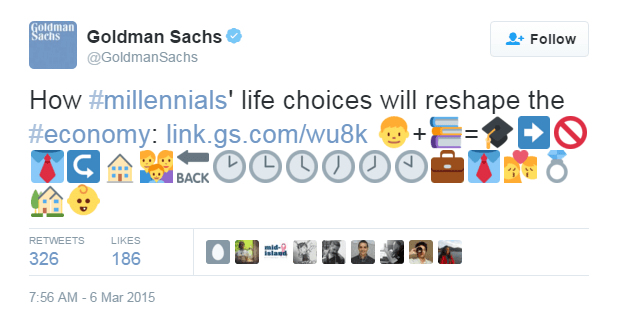
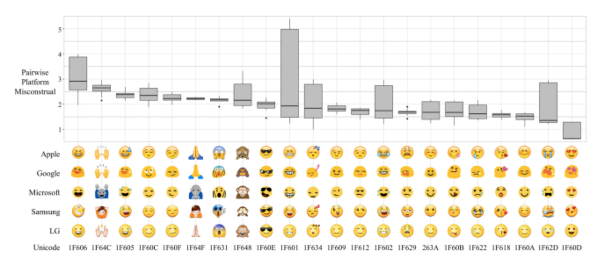
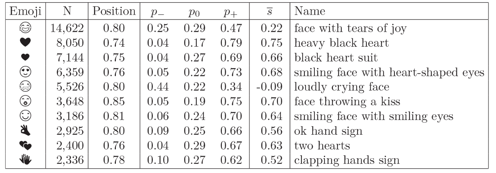
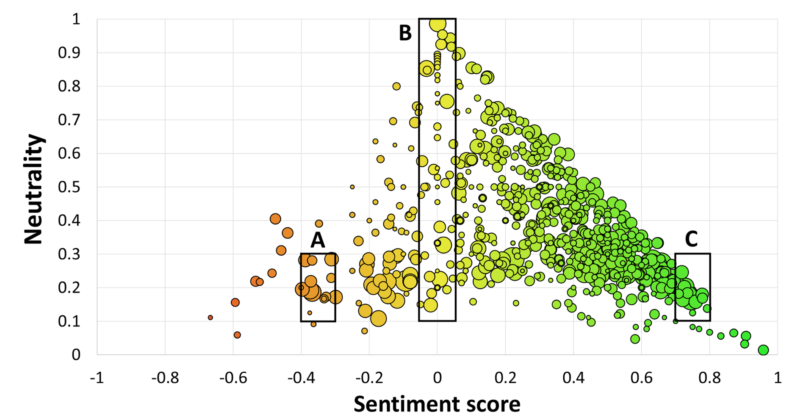
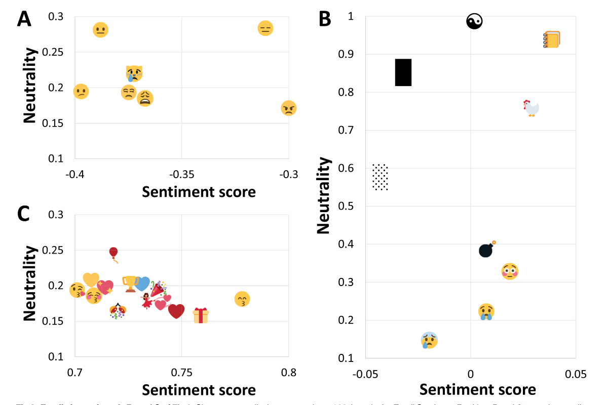

```{r setup, include=FALSE}
knitr::opts_chunk$set(echo = TRUE)
```

### Content

- Text analytics and its use in business/business research

### Basics

- Available instruments: R packages and methods

- Pre-processing:

- BoW approaches:

    - Sentiment analysis
    
**Text analytics** refers to applying statistical and machine learning techniques to extract useful insights from text 

The focus of my research is the use of text analytics for social media data. Businesses are excessively pressed for the need to engage with social media and explore its potential for stakeholders engagement, e.g. customers, shareholders. Companies target to monitor the social media space to understand customers' changes preferences, comptetitors offers, market trends, investors' sentiment.

```{r echo=FALSE, out.width=600, fig.cap="Text is messy, but tweets are messier! From https://blog.twitter.com"}

```

Basics:

**Bag of Word**: way of representing text data
 dimensions are words, values are their frequences
- most commonly used representation for text mining

- the ordering of words is lost

- text is converted to a sparse multidimensional representation: the universe of words (or terms) are dimensions (or features) 

- *Application*: classification, topic-modeling, and recommender systems

```{r echo=FALSE}

```

**Sequential representation** of text:

- the ordering is preserved: localized within sentence or paragraph boundaries

- text is a collection of smaller units, e.g. sentences, paragraphs 

- individual sentences are extracted as strings or sequences. 

- *Application*: language modeling, natural language processing

**Bag-of-words (BoW) vs sequential representation (SR)**: 
- Data-centric aspects: 
    - length of the text: small for SR, longer for BoW

- Application-centric aspects:
    - method requires to treat sentences as sentences -> SR, e.g. text summarization, information extraction, opinion mining, and question answering

**Tidy text**: "long" format where information is stored in “a table with one-token-per-row”:

- each variable is a column

- each observation is a row

- each type of observational unit is a table

**Token**: smallest unit of the text, e.g. words within a sentence, sentence within a text.

*Which token?*
a sentence, word, n-gram, morpheme, letter

**Term-document-matrix** (= document-feature matrix)

- statistical measure that shows importance of a word is in  a document in a collection of documents (corpus)

- the more times a word is used in a document, the higher the importance, but also how often a word appears in the corpus.

**Corpus**: a data set = collection of documents


*Lexicon*: collection of words and their meanings, complete and distinct set of words used to define the corpus

*TF = Term Frequency*: 
TF(t) = (Number of times term t appears in a document) / (Total number of terms in the document).

*IDF = Inverse Document Frequency*:
IDF(t) = log(Total number of documents / Number of documents with term t in it)

*Tf-idf* = TF * IDF

Tf-idf matrix:

- High-dimensional, sparse, and non-negative representation

- Dimensions: binary representation: 1 = the presence of a term in a document, 0, otherwise. 
most values of the dimensions are 0s, and only a few dimensions take on positive values

-Multidimensionality and sparseness of the data:
    - Number of words -> dimensions of data
    - Most word frequences are zero

**Language Modeling**: probabilistic models that are able to predict the next word in the sequence given the words that precede it.

Uses: Machine Translation, spell Correction, speech Recognition, summarization, question answering, sentiment analysis etc.

Depends on 
- tasks
- their specification
- heuristics
- preconditions


### R Packages

- `tidytext`: [0.2.1 version](https://cran.r-project.org/package=tidytext) 
    - new plotting functions
    - tokenizer for tweets
    - unnest_token has extra arguments for "tweets": `strip_punct` and `strip_url`.

-  `textdata`: `tidytext` uses it to access [lexicons](https://github.com/EmilHvitfeldt/textdata). Bing Liu lexicon (tidytext), AFINN (textdata), NRC lexicon (N/A)

*Changes*: licensing is fixed and the user needs to agree to dataset’s license/terms of use.

- `quanteda`: by Kenneth Benoit et al. for textual data management and analysis

Interestingly, differences exist between packages, even how some of the "straightforward" steps are done. The example below shows differences inhow tf-idf is calculated:

```{r, echo=TRUE, error=FALSE, warning=FALSE, message=FALSE}
library(tm)
library(tidytext) 
library(tidyverse) 
library(quanteda)
df <- as.data.frame(cbind(doc = c("doc1", "doc2"), text = c("the quick brown fox jumps over the lazy dog", "The quick brown foxy ox jumps over the lazy god")), stringsAsFactors = FALSE)

df.count1 <- df %>% unnest_tokens(word, text) %>% 
  count(doc, word) %>% 
  bind_tf_idf(word, doc, n) %>% 
  select(doc, word, tf_idf) %>% 
  spread(word, tf_idf, fill = 0) 

df.count2 <- df %>% unnest_tokens(word, text) %>% 
  count(doc, word) %>% 
  cast_dtm(document = doc,term = word, value = n, weighting = weightTfIdf) %>% 
  as.matrix() %>% as.data.frame()

df.count3 <- df %>% unnest_tokens(word, text) %>% 
  count(doc, word) %>% 
  cast_dfm(document = doc,term = word, value = n) %>% 
  dfm_tfidf() %>% as.data.frame()

df.count1
df.count2
df.count3
```

## Get your data:
Popular packages for working with Twitter : 

- [twitteR](https://cran.r-project.org/web/packages/twitteR/README.html) - depricated, only REST API

- [rtweet](https://rtweet.info/) REST API and stream API

*Note*: Twitter limits downloading tweets on their Standard API and also puts a cap on the number of search resuts returned (18,000 every 15 minutes). To collect more than 7+ day data, use `cronjob` for Linux/Unix or the `scheduler` for Windows. See [here](https://cran.r-project.org/web/packages/cronR/README.html) on how to set up a cronjob

```{r, echo=TRUE, error=FALSE, warning=FALSE, message=FALSE}
#Let's load tweets downloaded earlier
data <- read.csv("data/coffeeTweets.csv", encoding="UTF-8", stringsAsFactors=FALSE)
dim(data)

knitr::kable(data[1:3, 3:5], caption = 'Sample of downloaded data')

```
## Text Preprocessing 

* Get your data: social media platforms, application approval may be required!

* Preparation and cleaning
* Segmentation
* Tokenization
* Stop-word numbers and punctuation removal
* Convert to lowercase
* Converting to a "structured" form

    + Option 1 - tf df matrix:
    + Option 2 - tibble
    
*See [tidy-text approach](https://www.tidytextmining.com/tidytext.html)*

*Keep or remove?*
Data mining preceeds text analytics and refers to cleaning and data preparation: transformation of the unstructured text into a structured data, e.g. tf-idf matrix. But.. is it all noise?

- Text extraction and removal of web-specific elements

- stop-word removal: commonly occurring words with little discriminative power

### Textual paralanguage - Great, Umm, *Eyeroll*
Paralanguage (paralinguistics) is a component of meta-communication that may modify meaning, give nuanced meaning, or convey emotion

Textual paralanguage signals informality of the communication and has negative affect on perceptions of brand (company) competence. But when it is used by a brands spokescharacter, there is no negative effects as such communication is already perceived as informal.

### Emojis

```{r echo=FALSE, out.width=300}
knitr::include_graphics("image/emojis.png")
```

Emojis are ideograms and smileys used in electronic messages and web pages. Twitter now supports 1100+ emoji and develops its own project, [Twemoji](https://github.com/twitter/twemoji), that supports 3,075 emojis

[Emojitracker](http://emojitracker.com/) monitors the use of emojis on Twitter in realtime. 
)

```{r echo=FALSE, out.width=300}

```

Traditionally thought of as a ultimate elevator pitch for [business promotion](https://business.twitter.com/en/blog/5-ways-to-increase-your-tweet-engagements-with-emojis.html).

[AirBnb project]( https://christinequan.github.io/airtweets/) : "Describe your dream trip in 3 emojis"

```{r echo=FALSE, out.width=300}
knitr::include_graphics("image/emojis_airbnb.png")
```

```{r, echo=TRUE, error=FALSE, warning=FALSE, message=FALSE}

library(emo)
emo::ji("heart")
emo::ji("ghost")

emoji <- data %>%
  mutate( 
    emoji = ji_extract_all(text)
  ) %>%
  select(screen_name,emoji, text, created_at) %>% 
  unnest(emoji) 

knitr::kable(emoji[1:5,1:3], caption = 'Sample of emojis')
``` 

How-to:

- extract emojis from tweets, use `stringr` 
- use a dictionary to translate emojis - the "full" list of emojis are available [here](https://github.com/iamcal/emoji-data/blob/master/categories.json)
- [categorise](https://emojipedia.org/) emojis - json file [here](https://github.com/iamcal/emoji-data/blob/master/categories.json)

Read the emoji dictionary

```{r, echo=TRUE, error=FALSE, warning=FALSE, message=FALSE, eval=FALSE}

library(jsonlite)
emoji_data <- fromJSON("data/emoji.json")

emoji_cat <- fromJSON("data/categories.json")
``` 

or

`emojis.csv` thanks to [Jessica Peterka-Bonetta] (http://opiateforthemass.es/articles/emoticons-in-R/)

```{r, echo=TRUE, error=FALSE, warning=FALSE, message=FALSE, eval=TRUE}
emoji_dic <- read.csv2("data/emojis.csv") %>% 
  select(EN, ftu8, unicode) %>% 
  rename(description = EN, r.encoding = ftu8)
```
```{r, echo=TRUE, error=FALSE, warning=FALSE, message=FALSE}
knitr::kable(emoji_dic[1:5,], caption = 'Sample of emojis dictionary')

```

Once the matching was done everything else was like a breeze!

From this we can rank emojis by occurence in data

#### Sentiment analysis 

sentiment analysis is to define automatic tools able to extract subjective information, such as opinions and sentiments from natural language texts and images. 

How to:

- Sentiment of the text is the sum of sentiments of individual words (BoW approach)

- Based on sentiment lexicons

- Based on single words. 

Most common:

[AFINN](http://www2.imm.dtu.dk/pubdb/views/publication_details.php?id=6010): a score between -5 (negative sentiment) and 5 (positive sentiment)

[Bing](https://www.cs.uic.edu/~liub/FBS/sentiment-analysis.html): binary fashion into positive and negative categories

[NRC](http://saifmohammad.com/WebPages/NRC-Emotion-Lexicon.htm): words are categorised into positive, negative, anger, anticipation, disgust, fear, joy, sadness, surprise, and trust.

```{r, echo=TRUE, error=FALSE, warning=FALSE, message=FALSE, eval=FALSE}

remove_reg <- "&amp;|&lt;|&gt;"
tidy_tweets <- data %>% 
  filter(!str_detect(text, "^RT")) %>%
  mutate(text = str_remove_all(text, remove_reg)) %>%
  unnest_tokens(word, text, token = "tweets") %>%
  filter(!word %in% stop_words$word,
         !word %in% str_remove_all(stop_words$word, "'"),
         str_detect(word, "[a-z]"))
```

```{r, echo=TRUE, error=FALSE, warning=FALSE, message=FALSE, eval=TRUE}

#Examples of dictionaries
#Loughran and McDonald lexicon 
get_sentiments("loughran")
get_sentiments("loughran") %>%
  count(sentiment, sort = TRUE)

#Bing lexicon
get_sentiments("bing") %>%
  count(sentiment, sort = TRUE)
```

Adding sentiment to the dataset:

```{r, echo=TRUE, error=FALSE, warning=FALSE, message=FALSE, eval=FALSE}
tweets_sentiment <- tidy_tweets %>%
  inner_join(get_sentiments("loughran"))  %>%
  group_by(sentiment) %>% # group by sentiment type
  tally %>% # counts number of rows
  arrange(desc(n))

ggpubr::ggpie(tweets_sentiment, "n", label = "sentiment", 
              fill = "sentiment", color = "white", 
              palette = "Spectral")

#or lets investigate by top words use in each sentiment
tidy_tweets %>%
  inner_join(get_sentiments("loughran"))  %>%
  count(sentiment, word) %>%
  filter(sentiment %in% c("positive", "negative", 
                          "uncertainty", "litigious")) %>%
  group_by(sentiment) %>%
  top_n(15) %>%
  ungroup %>%
  mutate(word = reorder(word, n)) %>%
  mutate(sentiment = factor(sentiment, levels = c("negative",
                                                  "positive",
                                                  "uncertainty",
                                                  "litigious"))) %>%
  ggplot(aes(word, n, fill = sentiment)) +
  geom_col(alpha = 0.8, show.legend = FALSE) +
  coord_flip() +
  scale_y_continuous(expand = c(0,0)) +
  facet_wrap(~sentiment, scales = "free") +
  labs(x = NULL, y = "Total number of occurrences",
       title = "Words driving sentiment scores in coffee",
       subtitle = "From the Loughran-McDonald lexicon")
```

For social media: "traditional" sentiment analysis approaches does not!

```{r echo=FALSE}

```

- short/abbreviated
- informal linguistic
- non-standard English

Resources: [Twitter Dictionary aka Twittonary](https://twittonary.com/) and [Twerminology - Twitter Slang Words & Abbreviations] (https://www.webopedia.com/quick_ref/Twitter_Dictionary_Guide.asp)

Used in tweets emojis serve a paralanguage function. They are a powerful toolcapable of chaning the meaning of the message:

```{r echo=FALSE, out.width=300}

```

**Note**: Apart from paralanguage function of emojis, differences exist in how people perceive them!
A recent study from the University of Minnesota used  that 25 most popular emojis that looked like human faces and asked participants to look at five variations for each one, taken from Apple, Microsoft, and Android.
The participants were asked to rate each emoji's emotional meaning on a scale of -5 (strongly negative) to 5 (strongly positive). They also described each emoji in words. Here is what they found:


```{r echo=FALSE}

```

How to use emojis?

- discard (?!)

- generate a training corpus 

- use to support text sentiment classification

[Emoji Sentiment Ranking](https://journals.plos.org/plosone/article?id=10.1371/journal.pone.0144296) is used to develop a sentiment map of the 751 most frequently used emojis. The sentiment of the emojis is computed from the sentiment of the tweets in which they occur.

```{r echo=FALSE}

```

Visualization of emojis and sentiment:

```{r echo=FALSE}

```

The more positive emojis are on the right-handside of the map (green), while the negative ones are on the left-hand side (red). The bubble sizes areproportional to the number of occurrences. The position of an emoji is determined by its sentiment scores and its neutrality


Tweets with and without emojis (Welch’s t-test)

- Tweets with and without emojis have significantly different sentiment means. 

- Tweets with emojis are significantly more positive than the tweets without emojis.

How emojis are associated with the sentiment of the text of tweets?

```{r echo=FALSE}

```

Emojis that occur at least 100 times in the Emoji Sentiment Ranking. Panel A: negative emojis,panel B: neutral (top) and bipolar (bottom) emojis, panel C: positive emojis.

